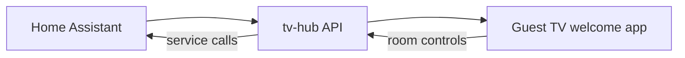

# Aatomhome — Airbnb Home Automation Welcome Screen

Per-room guest welcome and **control center** for Airbnb-style stays: room name on each TV, plus Home Assistant controls (lights, fan, blinds, and other selected devices).

This project is **separate from the frozen CDO production hub**. The live Cielo del Oro stack stays on its pinned release:

| | CDO production (do not break) | This project |
|---|-------------------------------|--------------|
| Repo | [redawg/adb-tv-hub](https://github.com/redawg/adb-tv-hub) @ `cdo-production-2026-09-11` | `aatomhome-airbnb-welcome` |
| Host | `172.18.1.137` (CDO LAN) | forest-ha / aatomhome (pilot) |
| Scope | Property-wide guest welcome + streaming | Room name + HA device controls per TV |

## Vision



- **Home Assistant** — source of truth for devices; staff configure which entities appear in each room.
- **tv-hub** — fork/evolution of adb-tv-hub with room config + HA bridge (TV never holds HA tokens).
- **Welcome app** — hero shows room name; new **Room controls** section for lights, fan, blinds.

## Repository layout (planned)

```
aatomhome-airbnb-welcome/
  tv-hub/                    # FastAPI + ADB server (fork from adb-tv-hub tag)
  guest-welcome/             # TV WebView UI + room controls
  homeassistant/
    custom_components/
      aatomhome_airbnb_welcome/   # HA integration: turnover + entity picker per TV
  deploy/
    forest-ha/               # Podman quadlets for HA + tv-hub on aatomhome
  docs/
    ARCHITECTURE.md
    UPSTREAM.md
```

## Upstream

Fork baseline: **adb-tv-hub** tag [`cdo-production-2026-09-11`](https://github.com/redawg/adb-tv-hub/releases/tag/cdo-production-2026-09-11).

Do not deploy experimental builds to the CDO production host without a maintenance plan.

## Implementation phases

1. HA custom integration — connect-all, guest check-in/out on forest-ha
2. Room config schema — `room_name` + per-TV welcome overrides
3. HA bridge — hub proxies light/cover/fan actions
4. TV room controls UI — D-pad friendly tiles
5. HA entity picker — assign devices per room from HA
6. forest-ha deploy bundle

Full plan: see `.cursor/plans/ha_room_control_center_e561c219.plan.md` in the Cursor workspace or `docs/ARCHITECTURE.md`.

## Status

**Scaffold only** — CDO production is saved; active development starts here.
