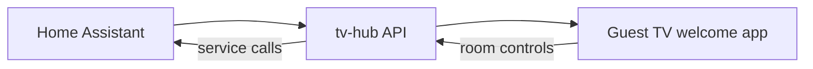

# Aatomhome — Airbnb Home Automation Welcome Screen

Per-room guest welcome and **control center** for short-term rental properties: each TV shows its room name, plus Home Assistant controls (lights, fan, blinds, and other selected devices).

## Quick start

| Step | Action |
|------|--------|
| **1. tv-hub** | Run the hub container on a Linux host on the same LAN as your TVs — see [docs/DEPLOY.md](docs/DEPLOY.md) |
| **2. HACS** | Add this repo as a custom integration — see [docs/HACS.md](docs/HACS.md) |
| **3. TVs** | Install the guest launcher APK and claim each TV — see [docs/TV-PROVISIONING.md](docs/TV-PROVISIONING.md) |

```bash
./scripts/configure-deploy.sh --type container --host 192.168.1.100 --port 8080
./scripts/deploy-profile.sh container
```

## HACS (Home Assistant)

This repository is **public** and uses the standard HACS layout (`hacs.json` + `custom_components/aatomhome_airbnb_welcome/`).

1. HACS → **Integrations** → ⋮ → **Custom repositories**
2. URL: `https://github.com/redawg/aatomhome-airbnb-welcome`
3. Category: **Integration**
4. Install **Aatomhome Airbnb Welcome** → restart HA → add integration with your hub URL

Full steps: [docs/HACS.md](docs/HACS.md)

## Architecture



- **Home Assistant** — device source of truth; staff pick which entities appear per room (roadmap).
- **tv-hub** — ADB + guest API server (evolved from [adb-tv-hub](https://github.com/redawg/adb-tv-hub)); TVs never hold HA tokens.
- **Guest launcher** — WebView home app loading the hub welcome page.

Details: [docs/ARCHITECTURE.md](docs/ARCHITECTURE.md) · Upstream baseline: [docs/UPSTREAM.md](docs/UPSTREAM.md)

## Repository layout

```
aatomhome-airbnb-welcome/
  custom_components/aatomhome_airbnb_welcome/   # HA integration (HACS)
  extensions/tv-hub/                          # Hub overlays (merged into upstream on deploy)
  guest-launcher/                               # Android TV launcher source + prebuilt APK
  deploy/profiles/                              # Podman quadlet profiles
  docs/
  hacs.json
```

## Implementation status

| Phase | Feature | Status |
|-------|---------|--------|
| 1 | HA integration — connect, check-in/out | Done |
| 2 | Room name sync per TV | Done |
| 3 | HA bridge (hub proxies service calls) | Done (hub `ha_bridge.py`) |
| 4 | Room controls on TV welcome UI | Done (`guest.js` + `room_routes.py`) |
| 5 | HA entity picker per room | Done (Setup → Rooms detail panel) |

## Prebuilt guest launcher (MIT)

| Asset | Path |
|-------|------|
| APK | [guest-launcher/releases/aatomhome-guest-welcome.apk](guest-launcher/releases/aatomhome-guest-welcome.apk) |
| SHA256 | [guest-launcher/releases/aatomhome-guest-welcome.apk.sha256](guest-launcher/releases/aatomhome-guest-welcome.apk.sha256) |

Android package id: `com.cielodeloro.guestwelcome` (legacy id from upstream; user-visible name is **Guest Welcome**).

## Documentation

| Topic | Doc |
|-------|-----|
| Container deploy | [docs/DEPLOY.md](docs/DEPLOY.md) |
| TV provisioning (APK + claim) | [docs/TV-PROVISIONING.md](docs/TV-PROVISIONING.md) |
| Networking | [docs/NETWORKING.md](docs/NETWORKING.md) |
| HA Green (integration only) | [docs/GREEN-HA.md](docs/GREEN-HA.md) |
| Deploy questionnaire | [deploy/QUESTIONNAIRE.md](deploy/QUESTIONNAIRE.md) |

## License

MIT — see [LICENSE](LICENSE). Guest launcher derived from upstream adb-tv-hub; see [NOTICE.md](NOTICE.md) if present.
