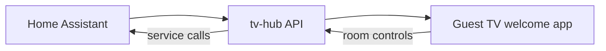

# Aatomhome — Airbnb Home Automation Welcome Screen

Per-room guest welcome and **control center** for Airbnb-style stays: room name on each TV, plus Home Assistant controls (lights, fan, blinds, and other selected devices).

This project is **separate from the frozen CDO production hub**. The live Cielo del Oro stack stays on its pinned release:

| | CDO production (do not break) | This project |
|---|-------------------------------|--------------|
| Repo | [redawg/adb-tv-hub](https://github.com/redawg/adb-tv-hub) @ `cdo-production-2026-09-11` | `aatomhome-airbnb-welcome` |
| Host | `172.18.1.137` (CDO LAN) | forest-ha / aatomhome (pilot) |
| Scope | Property-wide guest welcome + streaming | Room name + HA device controls per TV |

## Vision



- **Home Assistant** — source of truth for devices; staff configure which entities appear in each room.
- **tv-hub** — fork/evolution of adb-tv-hub with room config + HA bridge (TV never holds HA tokens).
- **Welcome app** — hero shows room name; new **Room controls** section for lights, fan, blinds.

## Repository layout (planned)

```
aatomhome-airbnb-welcome/
  tv-hub/                    # FastAPI + ADB server (fork from adb-tv-hub tag)
  guest-welcome/             # TV WebView UI + room controls
  homeassistant/
    custom_components/
      aatomhome_airbnb_welcome/   # HA integration: turnover + entity picker per TV
  deploy/
    forest-ha/               # Podman quadlets for HA + tv-hub on aatomhome
  docs/
    ARCHITECTURE.md
    UPSTREAM.md
```

## Upstream

Fork baseline: **adb-tv-hub** tag [`cdo-production-2026-09-11`](https://github.com/redawg/adb-tv-hub/releases/tag/cdo-production-2026-09-11).

Do not deploy experimental builds to the CDO production host without a maintenance plan.

## Implementation phases

1. HA custom integration — connect-all, guest check-in/out on forest-ha
2. Room config schema — `room_name` + per-TV welcome overrides
3. HA bridge — hub proxies light/cover/fan actions
4. TV room controls UI — D-pad friendly tiles
5. HA entity picker — assign devices per room from HA
6. forest-ha deploy bundle

Full plan: see `.cursor/plans/ha_room_control_center_e561c219.plan.md` in the Cursor workspace or `docs/ARCHITECTURE.md`.

## Status

**Deploy-ready scaffold** — CDO production is frozen; active development happens here.

### Deploy with an AI agent or from CLI

1. Copy [`deploy/env.template`](deploy/env.template) → `deploy/.env` and fill in answers from [`deploy/QUESTIONNAIRE.md`](deploy/QUESTIONNAIRE.md)
   - **forest-ha:** start from [`deploy/forest-ha/env.example`](deploy/forest-ha/env.example)
2. `./scripts/build.sh` — verify image builds
3. `./scripts/deploy.sh` — install on host

Agents: read [`AGENTS.md`](AGENTS.md) and [`.cursor/skills/aatomhome-deploy/SKILL.md`](.cursor/skills/aatomhome-deploy/SKILL.md).

### Prebuilt Android launcher (MIT)

| Asset | Path |
|-------|------|
| APK | [`guest-launcher/releases/aatomhome-guest-welcome.apk`](guest-launcher/releases/aatomhome-guest-welcome.apk) |
| SHA256 | [`guest-launcher/releases/aatomhome-guest-welcome.apk.sha256`](guest-launcher/releases/aatomhome-guest-welcome.apk.sha256) |
| License | [`LICENSE`](LICENSE) |

Package `com.cielodeloro.guestwelcome` — WebView home app for the hub welcome / control screen.

### What you need before deploy

| Item | Required for |
|------|----------------|
| `HUB_PUBLIC_URL` | TVs load welcome page |
| `HA_URL` + long-lived token | HA integration & future room controls |
| `TEMPEST_*` (optional) | Weather on welcome screen |
| TV wireless debugging + pairing | Register each TV in hub |

Full checklist: [`docs/DEPLOY.md`](docs/DEPLOY.md)
